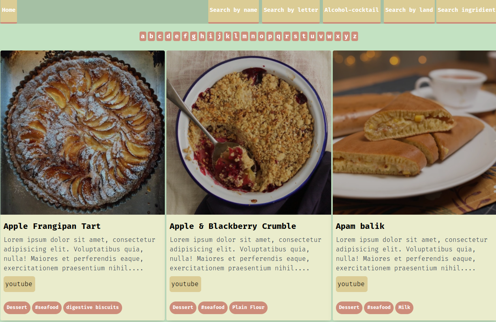

# Рецепты Вкусного Дня -

Сайт на котором можно найти различные рецепты блюд используя разные фильтры(по странам, буквам, ингредиентам), также здесь есть рецепты коктейлей. Приложение написано на Vue 3 с использованием Composition AP.Данные рецептов взяты с двух сервисов - Themealdb API и Edamam API.

Этот проект собрал при помощи [Create React App](https://github.com/facebook/create-react-app).

## Запуск

У вас должен быть установлен nodejs последней версии

В рабочей дирректории установите зависимости:

### `npm install`

Запустите проект

### `npm start`

#### Ссылка на проект
https://admirable-madeleine-faeb93.netlify.app/
